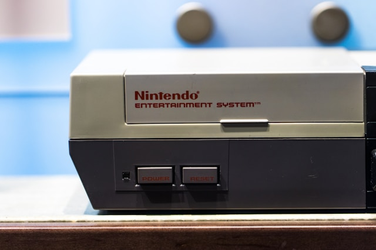
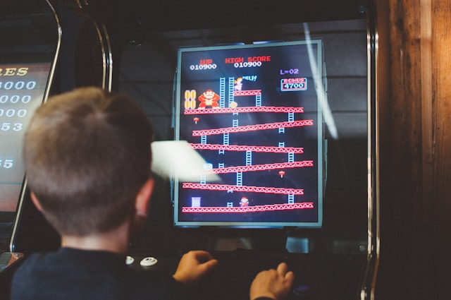
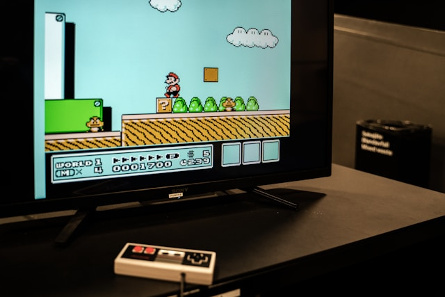

# NES Emulator  
  

For our NES emulator, we developed implementations for the core hardware components of a NES.  
This included the following:  
- Central Processing Unit (CPU)
- Picture Processing Unit (PPU)
- Audio Processing Unit (APU)
- Mappers
- Input Handlers

Our first target was the Donkey Kong ROM. This ROM consists of a static screen (no scrolling) and tested our CPU implementation along with the fundamentals of our PPU implementation.  

  

We ended up being able to generate a screen just like this with basic input handling over two sprints.  

Our next target was the Super Mario ROM. This ROM has much more complex rendering and fully tested the capabilities of our PPU.  

  

Development of the emulator is wrapping up and should be completed very soon!
